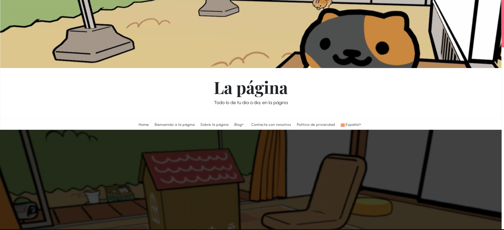
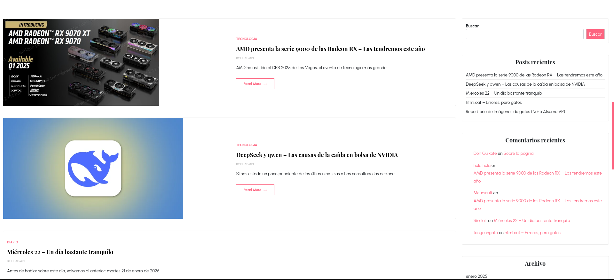
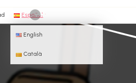
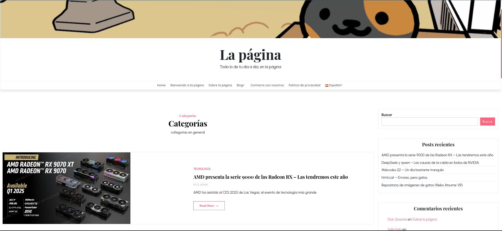
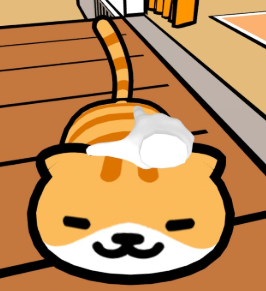
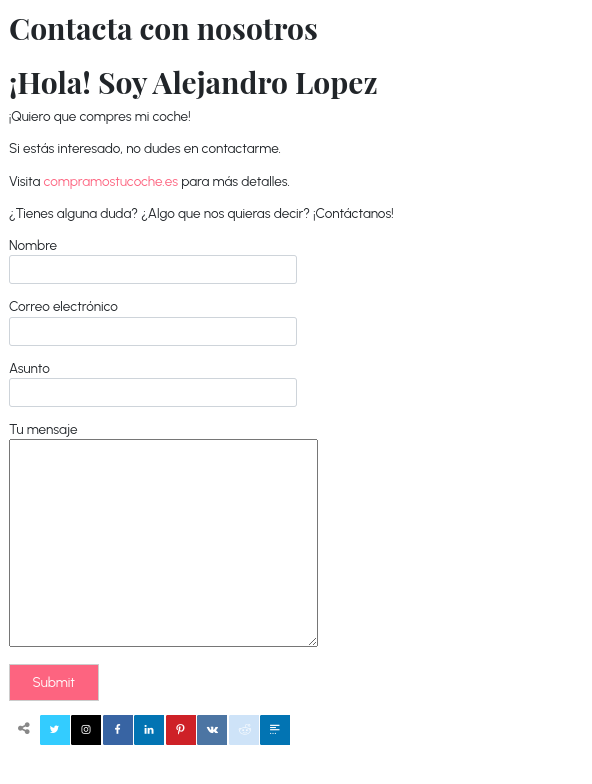

# La página
## Todo lo de tu dia a dia, en la página

## ¿Qué incluye mi página?

### Un blog en el que hablar sobre, principalmente, tecnología y gatos

En este blog, podrás conocer a gente nueva con los mismos gustos que tú.

### Un espacio en el que compartir tus opiniones como lector

Con la sección de comentarios, podrás opinar sobre los temas de los que hablamos en cada post.

### Fotos de gatos

¿Te gustan los gatos? A mí sí.

## ¿Qué plugins contiene?

He optado por plugins simples pero visualmente y prácticamente útiles y atractivos. Hay un cursor personalizado, un plugin para compartir artículos, páginas e incluso el texto que tengas seleccionado. Pero lo mejor...
¡Puedes cambiar el idioma de Español a Inglés y Catalán!

## ¿Por qué un tema tan simple?

He escogido este tema ya que es de los primeros que ví rebuscando un poco, y visualmente me gusta, a pesar de ser simple. 

## ¿Por qué "la página"?

¿Por qué no?

## ¿Hay publicidad?

Hay publicidad. Podrás ver anuncios de una persona que quizás conozcas pidiéndote que compres su coche.

## ¿Dudas?

Tenemos un forumulario de soporte en la página. ¡No dudes en contactarme ahí!

yo el 16 de febrero de 2025 a las 8 de la tarde:

